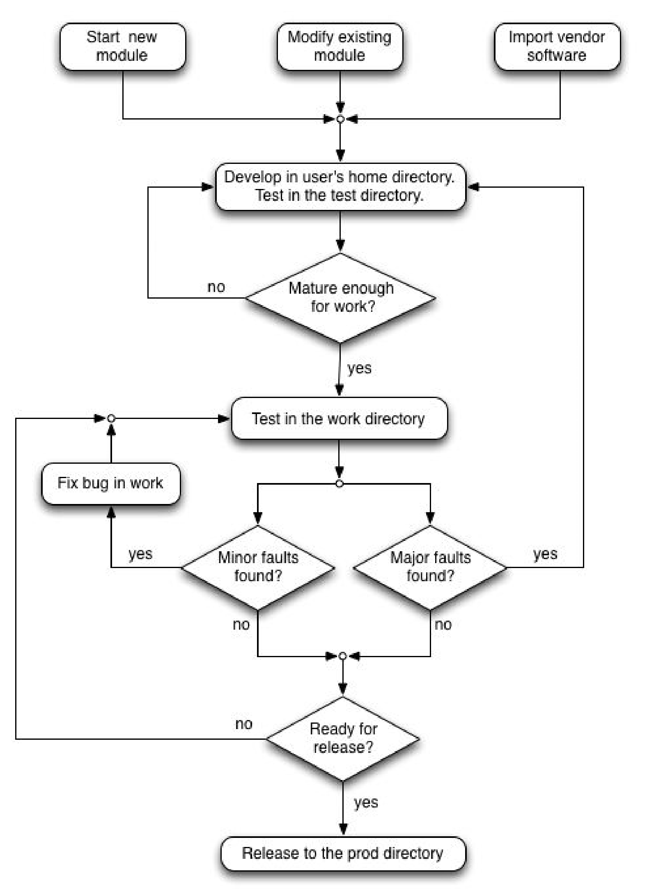

Software Development Standards

   Version 1.0, September 26, 2018

`1. Introduction 3 <#introduction>`__

`1.1. Overview 3 <#overview>`__

`1.2. Acronyms 3 <#acronyms>`__

`1.3. References 4 <#references>`__

`2. ADE Concepts 4 <#ade-concepts>`__

`2.1. Software Module Types 4 <#software-module-types>`__

`2.2. Software Maturity Categories 4 <#software-maturity-categories>`__

`2.3. Vendor Software 5 <#vendor-software>`__

`2.4. IOC Types 5 <#ioc-types>`__

`2.5. Software Dependencies 5 <#software-dependencies>`__

`2.6. Redirector 6 <#redirector>`__

`2.7. Naming Conventions 6 <#naming-conventions>`__

`2.7.1. Version Numbers 6 <#version-numbers>`__

`2.7.1.1. IOC Modules 7 <#ioc-modules>`__

`2.7.1.2. Support Modules 7 <#support-modules>`__

`2.7.1.2.1. Vendor Support Modules 7 <#vendor-support-modules>`__

`2.7.1.3. Branches 7 <#branches>`__

`2.7.2. IOC Names 8 <#ioc-names>`__

`2.7.3. Support Module Names 8 <#support-module-names>`__

`2.7.4. Redirector Links 8 <#redirector-links>`__

`2.8. ADE Profile and Environment Variables
9 <#ade-profile-and-environment-variables>`__

`2.9. ADE Directory Structure 9 <#ade-directory-structure>`__

`2.9.1. Working Area 9 <#working-area>`__

`2.9.2. Repository 10 <#repository>`__

`2.10. Release Notes 11 <#release-notes>`__

`3. Software Development using the ADE
12 <#software-development-using-the-ade>`__

`3.1. Software Development Process 12 <#software-development-process>`__

`3.2. Normal Development 14 <#normal-development>`__

`3.2.1. Initial Development 14 <#initial-development>`__

`3.2.2. Development in Work 14 <#development-in-work>`__

`3.2.3. Release to Production 15 <#release-to-production>`__

`3.2.3.1. Guidelines for releasing 15 <#guidelines-for-releasing>`__

`3.3. Major/Medium Redevelopment 15 <#majormedium-redevelopment>`__

`3.4. Bug Fix to Released Code (no longer in trunk)
16 <#bug-fix-to-released-code-no-longer-in-trunk>`__

`3.5. Vendor Software 16 <#vendor-software-1>`__

`3.6. Keeping Track of Versions 16 <#keeping-track-of-versions>`__

`4. Managing External Software 17 <#managing-external-software>`__

`4.1. Proposal for Managing External Software
17 <#proposal-for-managing-external-software>`__

`4.2. EPICS 17 <#epics>`__

`4.2.1. Base 17 <#base>`__

`4.2.1.1. EPICS Customizations 18 <#epics-customizations>`__

`4.2.2. Extensions 18 <#extensions>`__

`4.3. RTEMS 19 <#rtems>`__

`4.4. ADE Tools 19 <#ade-tools>`__

`4.5. TDCT 19 <#tdct>`__

`4.6. procServ 19 <#procserv>`__

Introduction 
============

The following document is a compilation of all standards and rules that
will guide any Real Time Software development process within the Gemini
Software Group. The main focus of the document is the Application
Development Environment (ADE), its components, its use cases and the
usage standards. The document also covers concepts and standards about
managing external software (e.g. EPICS, RTEMS, etc.). The goal is to
have clear guidelines to follow when starting any type of development
process, be it new projects or routine maintenance tasks.

Overview 
--------

The Application Development Environment to support the Gemini Real-Time
System software development process consists of the following
components:

-  A comprehensive directory structure which is maintained in a file
   system accessible to all developers and operational systems. The
   directory structure defines locations which reflect the module type
   (ioc or support module) and maturity (work or production).

-  A build server that’s in charge of compiling and installing new
   releases into the production area. The server always checks the
   software to build out from the repository. This ensures that what is
   built is reproducible from the repository.

-  A source code control system, based on Subversion along with a set of
   Python scripts that work with Subversion to standardize the processes
   in the software development cycle. Only source code and static
   configuration files are stored in the ADE Subversion repository.

-  A Build system based on GNU Make. The standard EPICS Build
   conventions are adopted, with enhancements including new Make rules,
   additional templates, macros, configuration files and consistency
   checking features.

Acronyms 
--------

======== ==================================================
ADE      Application Development Environment
======== ==================================================
EPICS    Experimental Physics and Industrial Control System
GUI      Graphical User Interface
IOC      EPICS Input/Output Controller
Soft IOC Software EPICS Input/Output Controller
NFS      Network File System
SVN      Subversion control system
======== ==================================================

References 
----------

[1] Gemini Application Development Environment User Manual

ADE Concepts 
============

Software Module Types 
---------------------

The following two types of software module are supported by the ADE:

-  **Support Module**\ ​: This is an EPICS software module which is
   intended to be used by another application or support module.
   ​\ **Typically it will consist of the software that implements a
   specific control system (e.g. the TCS or ECS), provides EPICS device
   or driver support software or provides a software library.**

-  **IOC Application**\ ​: This comprises the set of files which will be
   loaded and run on a specific IOC, making use of software from one or
   more Support Modules.

Software Maturity Categories 
----------------------------

The Gemini ADE categorizes software modules according to their
“maturity”, which is a measure of their apparent stability and
reliability. The ADE distinguishes three levels of software maturity:

-  **Unreleased software**\ ​: This software is not handled as part of
   the development environment and does not have a location in the
   standard ADE directory structure. This is software in its initial
   development and test stage which is not yet available for use by
   other users. The development and test work will typically be
   performed in a developer’s home directory area. It is not required
   for unreleased software to be committed to the repository.

-  **Work software**\ ​: This software is in a “ready for initial use
   with the real hardware” state but is considered to be under test and
   not ready for final release. It would typically be used during
   commissioning or engineering periods, but is not intended to be used
   during routine operations. It should be of a sufficient quality to
   allow it to be used in other IOC applications than the associated
   test application. The work software is installed in work by checking
   out from the trunk or a branch. Work software should have a minimum
   level of maturity such that: (a) it is defined in the ADE repository
   structure as a support module or ioc, and (b) it can build without
   errors after checking it out from the repository.

-  **Production software (prod)**\ ​. This software is in a well-tested
   state, ready for routine operational use. It will normally have been
   previously located in the work area. The software is released and
   installed using the ADE tools and is protected with read-only access.
   Multiple versions of production release software modules can be
   maintained simultaneously. The software will have an associated
   version name, which corresponds to a tag in the repository, and a
   RELEASE.NOTES file describing the changes introduced in each version.
   Production software has the essential quality that it is committed to
   the repository as a tagged release, so it is traceable. This is
   enforced by the ADE tools.

Vendor Software 
---------------

Vendor software is any software imported from outside Gemini like EPICS
modules or any other software. The ADE provides scripts to manage vendor
software within the ADE in a separate area of the Subversion repository.

IOC Types 
---------

The ADE is designed to build and install software for all types of EPICS
IOCS, including RTEMS and VxWorks (hardware) IOCs as well as Soft Linux
IOCs.

A Soft IOC is an EPICS IOC running on a non-embedded Linux host. There
can be more than one Soft IOC per Linux host. A soft IOC normally does
not depend on any hardware on the host with the exception of standard
communications interfaces such as Ethernet.

Software Dependencies 
---------------------

An IOC application or support module will usually depend on specific
versions of one or more software support modules, either in production
(prod) or work. It will always also depend on an specific version of
EPICS.

Modules in work can depend on modules in work or prod. The dependencies
in prod should be preferred over the ones in work unless there’s a good
reason not to. This will make easier to release the module to production
later.

Under no circumstances a released module in prod should depend on
modules in work (or even worse, unreleased modules). If there’s the
need, for instance in an IOC application, to use a new feature from a
module in work, then the whole IOC should be moved to work for testing
with the new feature(s) during the day. Once the tests are complete, the
support module(s) and IOC can be released to prod following the
guidelines in section 3.

The file called ​\ **RELEASE**\ ​ in the application’s
​\ **configure**\ ​ directory should be used to define module
dependencies and each module respective locations (e.g. work, prod).
Only dependencies that are actually being used should be listed in this
file since this information is used to decide what modules to rebuild
when a new version of a dependency becomes available.

The potential exists for conflicting dependencies, for example where a
module has a dependency on multiple modules, which may also have
dependencies on a common module. In principle, only a single, specified
version of a dependent module should be used everywhere when a module is
built. Such conflicts are automatically detected and flagged at build
time.

Redirector 
----------

The ADE has a mechanism (the “redirector”) to allow switching an IOC
from one version to another without having to change the IOC boot
parameters. This is done by creating a soft file link with a fixed name
that points to the actual boot script file to be used by the IOC.

The redirector links are kept in ​\ */gem_sw/prod/redirector*\ ​. The
ADE provides a tool to switch an IOC from one version to another
(​\ **configure-ioc**\ ​). Under no circumstances the links should be
changed by hand since this may introduce inconsistencies in the setup.

Naming Conventions 
------------------

Version Numbers 
~~~~~~~~~~~~~~~

When new software is released it needs a new version number. We’ll use
an adaptation of the Semantic Versioning system that uses a sequence of
three digits (Major, Minor, Patch).

Major version numbers change whenever there is some significant change
being introduced. Minor version numbers change when a minor feature or
bug fix is introduced, or when a set of smaller features is rolled out.
Patch numbers are optional and will be reserved for bug fixes of
released code.

The Major number should start from one. The Minor version number and the
Patch number can start from zero.

IOC Modules 
^^^^^^^^^^^

The version number for an IOC should use the following naming
convention: **<major>-<minor>[-p<patch>]**

Bug fixes applied to the trunk will increase the ​\ **<minor>**\ ​
number.

The ​\ **<patch>**\ ​ number will only be used when releasing a bug fix
from a released version of the software that’s no longer in the trunk. A
“\ **p**\ ​ ” should be placed before the​ *<patch>*\ ​ ​ number to
separate it from the rest of the version number.

Support Modules 
^^^^^^^^^^^^^^^

Support modules written within Gemini will follow the same naming
convention as IOC modules.

Vendor Support Modules 
''''''''''''''''''''''

Vendor support modules that already had a version number assigned by the
original author will use the following naming convention:

   **<original-version>-<minor>[-p<patch>]**

where ​\ **<original-version>**\ ​ will be the version assigned by the
original author.

The ​\ **<minor>**\ ​ number will be increased any time a modification
is made after the module was incorporated to the ADE. It should be
omitted if no modifications were needed to incorporate the package.

No major number is used in vendor software since we don’t expect major
modifications in this case. However, if this were necessary, then
probably a new module should be created.

The ​\ **<patch>**\ ​ number will be used a bug fix from previously
released version of the software (unlikely). A “\ **p**\ ​ ” should be
placed before the ​ *<*\ ​ *patch>*\ ​ number to separate it from the
rest of the version number.

A file called ​\ **VERSION**\ ​ should be created in the module top
directory to keep track of the original version, if the module does not
include one.

Branches 
^^^^^^^^

Branch names should be a string describing the purpose of the branch.
The name should start with a letter to avoid confusing it with a version
number.

If a release is made from a branch, the name of the branch should be
included in the released version as follows:

   **<major>-<minor>-<branch>-<release>-[-p<patch>]**

Where ​\ **<major>**\ ​ and ​\ **<minor>**\ ​ refer to the version the
branch was derived from. Bug fixes applied to the branch will increase
the ​\ **<release>**\ ​ number.

The **<**\ ​ **patch>** number will only be used when releasing a bug
fix from a released version of the​ software that’s no longer in the
branch “trunk”. A “​\ **p**\ ​” should be placed before the ​\ *<patch>*
number to separate it from the rest of the version number.

**Note**\ ​: Please note that the preferred method is to first merge the
branch into the trunk and use the normal convention for version numbers.

IOC Names 
~~~~~~~~~

The operation of the ADE depends on a consistent naming scheme being
adopted for all operational IOCs. The host name of the IOC must be set
correctly to enable it to automatically locate and access the scripts
and application software for use with the IOC. Gemini IOCs have names of
the form:

   **<system>-<location>-ioc**

where ​\ **<system>**\ ​ is a lowercase string uniquely identifying the
IOC associated with a specific telescope subsystem.

The ​\ **<location>**\ ​ is the physical location of the IOC, and can
either **cp**\ ​ (Pachon), ​ **mk**\ ​ (Mauna​ Kea), ​\ **hbf**\ ​ (Hilo
Base Lab) or ​\ **sbf** (La Serena Lab). For instance, the IOC
controlling the mount at​ Mauna Kea will be ​\ **mcs-mk-ioc**\ ​.

Support Module Names 
~~~~~~~~~~~~~~~~~~~~

The names of new Gemini support modules should have words capitalized
and should start with a lowercase letter (e.g. mySupportModule). Those
that come from the community will retain their original names. Old
Gemini support modules (e.g. timelib) do not need to be renamed to
adhere to the standard.

Redirector Links 
~~~~~~~~~~~~~~~~

For production systems (e.g. the MCS) the redirector link should follow
the same convention as for the IOC names.

For lab systems the redirector link should use the following convention:

   **<host name>-<location>-ioc**

Where, ​\ **<host name>**\ ​ is the name of the CPU board hostname (e.g.
labvme1, sim1, etc). The motivation for this is to keep the redirector
directory as clean as possible. Besides, it doesn’t make sense to have
more links than actual CPU boards available.

In those cases where a permanently test system is needed (e.g. the TCS
simulator) an “alias” entry in the redirector may be created (e.g.
​\ *tcsim-sbf-io*\ ​c). However, the preferred method would be to assign
a hostname (and IP address) for this purpose and use that instead.

Systems not following these naming conventions will create clutter in
the system. They will be removed. A review of these will happen at least
once per year. It is everyone responsibility to maintain the redirector
directory clean.

ADE Profile and Environment Variables 
-------------------------------------

The file ​\ */gem_sw/etc/profile*\ ​ contains the Gemini ADE environment
definitions. This file must be sourced (usually from the ~/.bashrc file)
by anyone using the Gemini ADE. The ADE User Manual [1] has the details
of the environment variables needed by the ADE.

ADE Directory Structure 
-----------------------

Working Area 
~~~~~~~~~~~~

-  **/gem_sw**

**○ /epics**

■ **/etc**\ ​ ​\ *[global configuration scripts]*

■ **/R3.14.12.7**\ ​ ​\ *[each EPICS version has its own base and
extensions]*

-  **/base**

-  **/extensions**

*■ ...same for other EPICS releases*

**○ /targetOS**

**■ /RTEMS**

**■ /vxworks**

**○ /prod**

**■ /R3.14.12.7**

-  **/ioc** ​\ *[IOC applications]*

-  **/support** *[*\ ​ *support modules]*

*■ ...IOC’s and support modules for other EPICS releases*

**■ /etc**\ ​\ *[files used by the build and release system]*

-  **/scripts**

-  **/build ■ /common**

-  **/python**\ ​ ​\ *[python scripts and tools; tools used by the build
   system]*

■ **/redirector**\ ​ ​\ *[links used to define where IOC’s boot from]*

○ **/work**\ ​ ​\ *[same structure as /prod, but contents are not
tagged]*

**○ /test**\ ​ ​\ *[used to install & run software developed in the
user’s home directory]*

■ pgigoux

■ mrippa

■ ...etc

○ **/etc**\ ​ ​\ *[login profiles and TDCT startup scripts]*

Repository 
~~~~~~~~~~

**● Parent directory**

○ **branches**\ ​\ :sup:`/` ​\ *[branches are stored here]*

**■ ioc**

**■ Support**

○ **release**\ ​\ :sup:`/` ​\ *[tagged versions are stored here]*

**■ ioc**

**■ Support**

○ **trunk**\ ​\ :sup:`/` ​\ *[da trunk]*

**■ ioc**

**■ Support**

○ **vendor**\ ​\ :sup:`/` ​\ *[imported vendor software are stored
here]*

**■ ioc**\ ​ ​\ *[we don’t have any vendor ioc’s yet, but this is where
they would be stored]*

**■ support**

Release Notes 
-------------

A new entry should be created in the RELEASE.NOTES file every time a new
version is released. Each entry should start with a title detailing the
product (IOC or Support Module) and version number. For each version,
the file should detail (1) any additions, (2) any improvements and/or
bug fixes, and (3) any compatibility issues with older versions.

A default template will be created in the IOC or support module top
directory when a new module is created using the ADE tools.

Software Development using the ADE 
==================================

Software Development Process 
----------------------------

The development process for a software module which in the ADE is
summarized in the figure below. With a few exceptions, all interactions
with the repository are performed using the ADE Python scripts.

|image0|

Normal Development 
------------------

This is the steady development of a support module or IOC application
using a linear development/release schedule. The code is available or
will be committed to the trunk.

Initial Development 
~~~~~~~~~~~~~~~~~~~

For the case where we are creating a completely ​\ **new**\ ​ support
module or IOC application, development begins by running
​\ **gem-start-new-module.py**\ ​. The user has the option of creating
an entry in the repository at this time.

For the case where we are modifying an existing support module or IOC
application (bug-fixes or adding new features), development begins by
running ​\ **gem-checkout-module.py**\ ​. This will check out the code
from the trunk.

The first stage of the development process will take place in a
sub-directory of the developer’s home directory. Booting the IOC
application will be done from the

**/gem_sw/test/<user>**\ ​ area. The user will have to set the
​\ *INSTALL_LOCATION*\ ​ variable in *configure/CONFIG_SITE*\ ​ to make
the build system install the software in the test area.

Note: It is not possible to boot an RTEMS IOC from the user’s home
directory because the OS does not allow booting from directories that
are NFS mounts (​\ *prod*\ ​, ​\ *work,* ​and​ *test*\ ​ are located on
the summit, but the home directories at the base facility).

Development in Work 
~~~~~~~~~~~~~~~~~~~

When the new version on trunk is ready it can be checked out into work
for testing on an operational IOC. ​\ **gem-checkout-module.py**\ ​ is
run to check-out the support module or IOC application from the trunk
into the work tree.

Development in work should be restricted only to minor bug fixes found
while testing the module. No changes in the dependencies in the
​\ *configure/RELEASE*\ ​ file should be made in a software installed in
work to prevent breaking other modules that rely on this software.
Commits to Subversion can be done at any time to provide traceability.

Major reworks to the code should be done in the user’s home directory
and tested as if it were initial development. It can then be redeployed
in work again.

For an IOC application, the script ​\ **configure-ioc**\ ​ should be run
to modify the IOC boot script location to set this particular IOC to
boot from the work version. The ​\ **configure-ioc**\ ​ script must be
run again so that the production IOC boots from the prod tree once the
testing is finished.

Release to Production 
~~~~~~~~~~~~~~~~~~~~~

When the system is ready for release, ​\ **gem-release.py**\ ​ is run to
generate a release tag and export the application to the prod area. No
dependencies to modules in work should be present in
​\ *configure/RELEASE*\ ​ at this point.

By default, ​\ **gem-release.py**\ ​ generates a release from the trunk.
It is also possible to create a release from a branch, although, the
preferred method is to merge the branch back into the trunk and then
release from there.

**gem-release.py**\ ​ will do a test build first, before scheduling the
module to be checked out and built in prod by the build server. The next
time the build cron job runs on the build server, it will notice a
scheduled build, check the module out and build it. The new tagged
version will be created in the repository at this point.

A new release should always come with a short summary under the
RELEASE.NOTES file.

Releases should be named according to conventions defined in ​\ *Naming
Conventions*\ ​.

Guidelines for releasing 
^^^^^^^^^^^^^^^^^^^^^^^^

1. Add a meaningful summary to the RELEASE.NOTES file

2. Check that all dependencies come from PROD

3. Only compile for the architecture you are going to install the system
   (CONFIG_SITE). During initial development, it is advisable to
   restrict the number of architectures to just one to reduce
   compilation time.

Major/Medium Redevelopment 
--------------------------

This occurs when a significant change is required to a support module or
IOC application that’s expected to take a long time to implement. During
this period of time, it’ll still be possible to modify the existing
support module or IOC application (in trunk) as a result of user
demands, including bug fixes.

A feature branch is created to develop and test the application
including the new feature. This process is basically the same as the
​\ *Initial Development*\ ​ phase described above. However in this case
development begins by running ​\ **gem-start-feature-branch.py**\ ​
instead of *gemstart-new-module.py*\ ​ or
​\ *gem-checkout-module.py*\ ​.

Also ​\ **gem-sync-from-trunk.py**\ ​ should be run periodically to keep
the code up to date with what is in trunk.

When complete the feature branch should be merged back into trunk using
the ​\ **svn merge** command.

Testing an releasing to production will be done in the same way as in
the ​\ *Normal Development* process.

Bug Fix to Released Code (no longer in trunk) 
---------------------------------------------

This occurs when a support module or IOC application has been released
to production (the prodarea), some time has elapsed and bugs have been
found. We have to fix the bugs for this particular release, despite the
fact that further development and later releases of this support module
or IOC application have been made since the release.

This situation is not intended to happen in normal circumstances and it
should be avoided where possible. This process is basically the same as
the Initial Development phase. However in this case development begins
by running ​\ **gem-start-bugfix-branch.py**\ ​ rather than
gemstart-new-module.py or gem-checkout-module.py.

Unlike the ​\ *Major Development*\ ​ process, the script
​\ **gem-sync-from-trunk.py**\ ​ must **not**\ ​ ​ to be used to sync
from the trunk since we are working from a tagged version.

When the software is ready to be released, ​\ **gem-release.py**\ ​
should be run using the ​\ **–b** (branch) option to specify the branch
where the release will be made from. The version naming conventions for
this case are described in the ​\ *Naming Convention*\ ​ section.

.. _vendor-software-1:

Vendor Software 
---------------

Code for a new module that has already been supplied by an external
vendor it should be imported using ​\ **gem-vendor-import.py**\ ​. The
script will first import it into the vendor area of the repository and
then make a copy of the software to the trunk. Any further development
and/or bug fixes should be made from the trunk as it were an internal
module.

A file called ​\ **VERSION**\ ​ should be created in the module top
directory to keep track of the original version, if the module does not
include one.

Keeping Track of Versions 
-------------------------

Every time a new support module and/or IOC the new versions should be
recorded in the *Versions and Dependencies spreadshee*\ ​t in Google
Docs.

The ​\ **canonical version**\ ​ column keeps track of the latest
“official” version of a support module. Ideally, all support modules and
IOC’s should only depend on the canonical versions of other modules. In
practice, and especially during periods of upgrading and/or testing,
more than one version of a support module could be in use at the same
time.

**Note**\ ​: We’ll replace the spreadsheet with a more automated way of
keeping track of versions in the future.

Managing External Software 
==========================

Proposal for Managing External Software 
---------------------------------------

Any software package that’s not released into
​\ **/gem_sw/prod/<epics-version>/**\ ​ can be managed as a vendor
module within the ADE using the standard development workflow. With the
following differences:

1. Tagged releases will be made using the Subversion copy command
   instead of using the *gem-release.py*\ ​:

..

   **svn copy <trunk> /gem_sw/release/<module>/<tag>**

2. Releasing the software will be done by checking out the code from the
   tag into the place where the software is supposed to be installed.

..

   **cd <installation directory>**

   **svn checkout <parent directory>/release/<module>/<tag>**

Version numbers will be assigned using the same conventions that were
stated in the *Version*\ ​ *Numbers*\ ​ section. This approach has the
following advantages and disadvantages:

-  **Pros**\ ​: The software will be under revision control and will be
   handled in the ADE repository and (to some extent) within the ADE
   workflow.

-  **Cons**\ ​: We’d need to manually checkout software and manage
   releases, bypassing the ADE. This could be solved if we extend the
   ADE tools to handle external software.

EPICS 
-----

Base 
~~~~

The EPICS community keeps the EPICS base in
​\ \ `GitHub <https://github.com/epics-base>`__\ `​. <https://github.com/epics-base>`__
We keep a cloned version of this repository in
​\ `https://github.com/gemini-rtsw/epics-base\ ​. <https://github.com/gemini-rtsw/epics-base>`__
Any modifications and customizations to the EPICS can be tracked using
​\ **git**\ ​ and ​\ *GitHub*\ ​.

The software will be installed by checking it out from ​\ *GitHub*\ ​
(in ​\ */gem_sw/epics/<epics release>*\ ​) and compiling it in place.

We’ll assign version numbers as if EPICS were a vendor package, i.e.
we’ll retain the conventions used in the EPICS community, but we’ll use
our naming conventions for upgrades and patches defined for ​\ *Vendor
Support Modules*\ ​.

Ideally, only a single EPICS release would be in use with the Gemini ADE
at one time. In reality, especially during periods of upgrading,
multiple EPICS releases could be supported simultaneously.

EPICS Customizations 
^^^^^^^^^^^^^^^^^^^^

When upgrading EPICS base, we have to add in our Gemini customizations
​\ *base/configure*\ ​, *base/bin*\ ​, and *base/templates*\ ​ ​
directories.

-  **base/configure**\ ​: We have to add ​\ *CONFIG.Gem*\ ​,
   ​\ *RULES.Gem*\ ​ and ​\ *RULES_TOP.Gem*\ ​, as well as making our
   modifications to ​\ *CONFIG_SITE*\ ​ and ​\ *CONFIG_SITE_ENV.*

-  **base/configure/os**\ ​: Need to add the Gemini customized version
   of *CONFIG_SITE.Common.RTEMS.*

-  **base/bin/linux_x86_64**\ ​: Need to add in
   ​\ *convertGemRelease.pl*\ ​.

-  **base/templates/makeBaseApp/top**\ ​: Need to add the customized
   Gemini template directories ​\ *gemIocApp*\ ​, ​\ *gemIocBoot*\ ​ and
   *gemSuppApp*\ ​ ​.

-  **base/templates/makeBaseApp/top/configure**\ ​: Need to add in the
   Gemini customized versions of *CONFIG*\ ​ ​, *RULES*\ ​ ​ and
   *RULES_TOP.*\ ​

The EPICS customizations should all be managed as vendor modules
following the proposal for external modules.

Extensions 
~~~~~~~~~~

Of all the extensions we use, only ​\ **edm**\ ​, ​\ **medm**\ ​ and
​\ **msi**\ ​ really need the EPICS build system to compile. According
to the module notes, they are installed by uncompressing the code into
the *extensions/src*\ ​ directory.

The other two modules: ​\ **procServ**\ ​ and ​\ **TDCT**\ ​, do not
depend on EPICS at all and should be moved somewhere else.

Regardless of where they are installed, they should all be managed as
vendor modules following the proposal for external modules.

RTEMS 
-----

RTEMS is available in GitHub, but for versions newer than the one we use
right now. Thus, it should be managed using as a vendor module following
the proposal for external modules.

ADE Tools 
---------

So far, the ADE Tools are not maintained in a repository. We cannot use
Github for this purpose since the ADE is based on proprietary code.
Thus, it should be managed using as a vendor module following the
proposal for external modules.

TDCT 
----

TDCT so far has been handled as an EPICS extension in binary (jar) form.
It resides in */gem_sw/epics/<epics version>/extensions/src/tdct*\ ​,
which is a symlink to ​\ */gem_sw/epics/<epics
versions>/extensions/src/tdct-<version>*\ ​, where ​\ *<version>*\ ​ is
of the form ​\ *<xx>.<yy>.<zz>*\ ​. TDCT really ought to be moved out of
the extensions directory, as it has no dependency on the version of
EPICS under which it is installed (it has no dependency on EPICS at
all).

TDCT comes in two packages:

-  **tdct_dist**\ ​: Contains the JAR files and help files for the TDCT
   Java application. Generally when TDCT is upgraded, only the tdct_dist
   package is updated.

-  **tdct_support**\ ​: Contains the schematic symbol files and the
   edb.def file.

Every time a new version of TDCT is available, we first duplicate the
current directory structure, then unzip the new **tdct_dist**\ ​ ​
package inside it to overwrite the previous distribution.

The files in the ​\ **tdct_support**\ ​ package have been customized for
our use at Gemini, so we must keep what we had before and not reinstall
the original support package.

Both ​\ **tdct_dist** ​and​ **tdct_support** ​should be managed as
vendor modules following the proposal for external modules. TDCT should
be installed in ​\ *[*\ ​\ **to be defined**\ ​\ *]*\ ​ in the ADE tree.

procServ 
--------

**procServ**\ ​ should be managed as a vendor modules following the
proposal for external modules. It should be installed in ​\ *[*\ ​\ **to
be defined**\ ​\ *]*\ ​ in the ADE tree.

